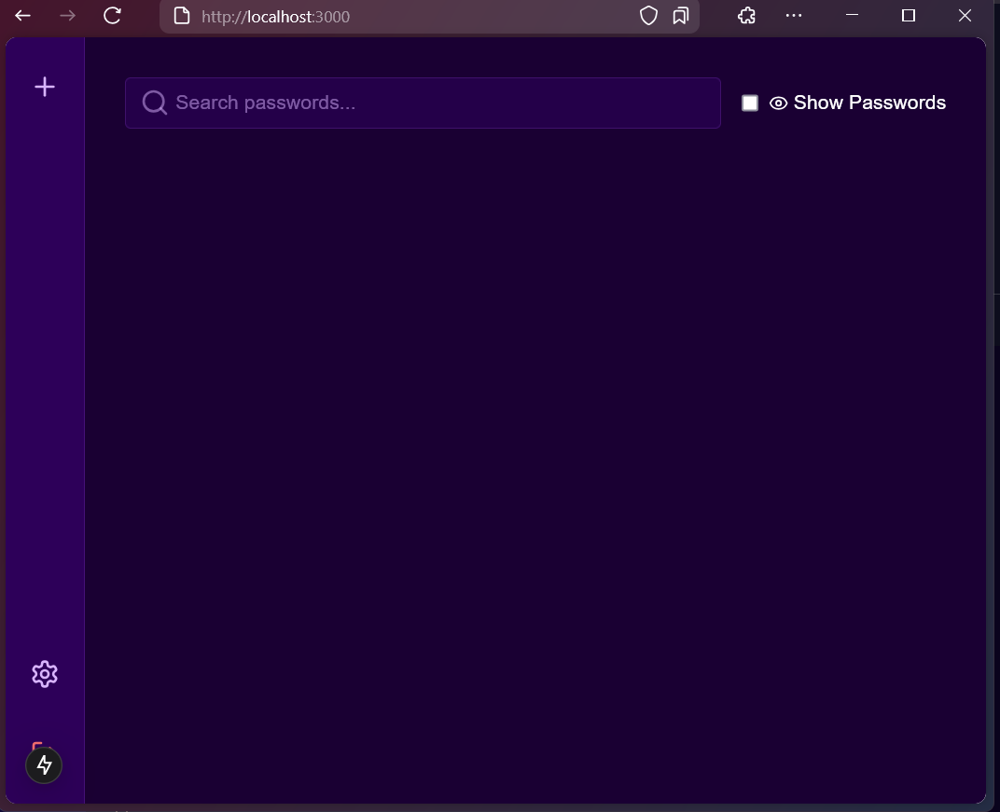
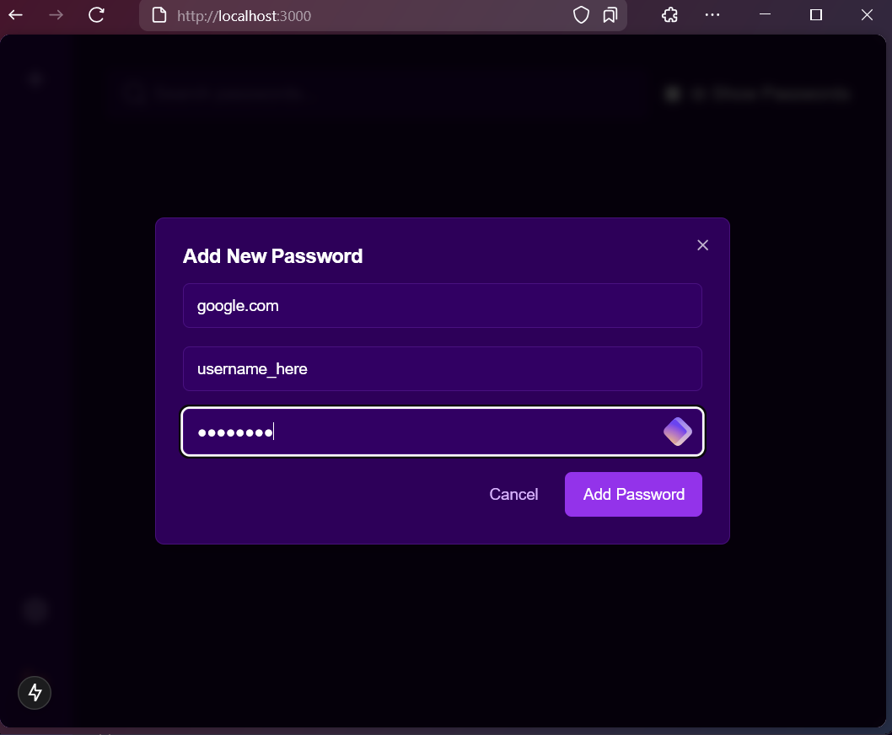
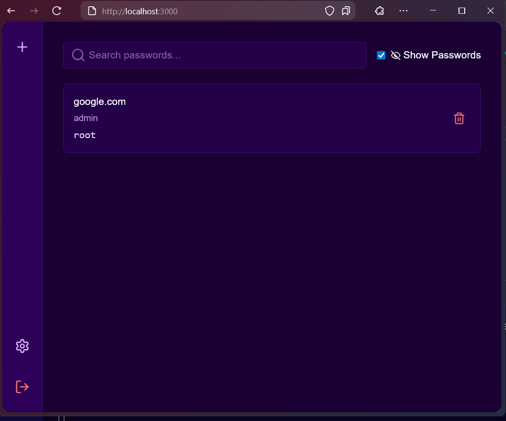
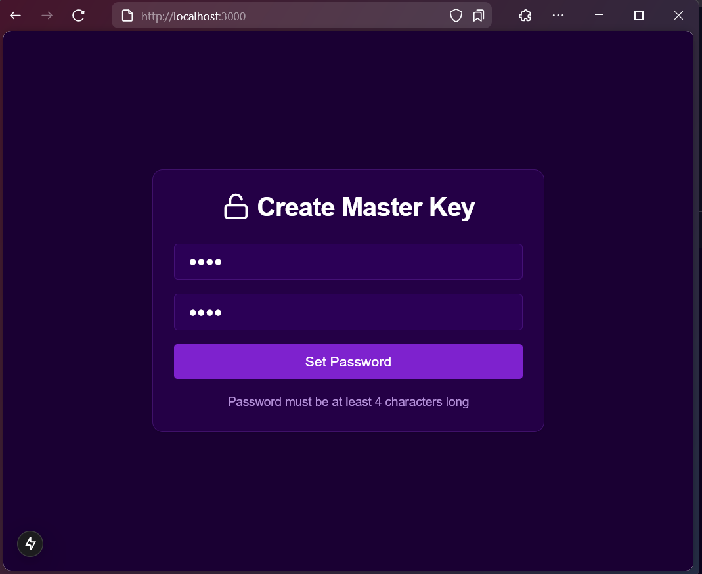

# 🔐 Password Manager

A secure password manager built with Rust, featuring AES-256-GCM encryption, Argon2 hashing, and both a web API and CLI interface. This project prioritizes security and provides a robust solution for managing your passwords.

## 🚀 Features

* **Master Password Protection:** Securely protected using Argon2 hashing.
* **AES-256-GCM Encryption:** Passwords are encrypted using AES-256-GCM for strong confidentiality and integrity.
* **SQLite Database:** Encrypted SQLite database for persistent and secure storage.
* **Web API (Actix-Web):** Manage passwords programmatically via a RESTful API.
* **CLI Support:** Interact with the password manager directly from the command line.
* **Zeroization:** Sensitive data is securely erased from memory after use.
* **Frontend (Next.js):** Modern and user-friendly web interface.

## 📦 Installation

This project consists of a frontend (Next.js) and a backend (Rust). Follow the instructions below to set up both.

### 1️⃣ Frontend Setup (Next.js)

#### Requirements

* [Node.js](https://nodejs.org/)
* [npm](https://www.npmjs.com/) (or yarn)
* [Git](https://git-scm.com/)

#### Installation and Running

```bash
git clone https://github.com/Amitminer/PasswordManager-Rust.git
cd PasswordManager-Rust/website
npm install  # or yarn install
npm run dev    # or yarn dev
```

This will start the development server. The frontend will typically be available at `http://localhost:3000`.

#### Frontend Screenshots

Take a look at some screenshots of the frontend interface:

- 
- 
- 
- 

### 2️⃣ Backend Setup (Rust)

#### Requirements

* [Rust](https://www.rust-lang.org/tools/install)
* [Cargo](https://doc.rust-lang.org/cargo/index.html)
* SQLite (usually bundled with `rusqlite` crate, no separate installation needed)

#### Installation and Running

```bash
cd PasswordManager-Rust
cargo build --release  # Build the release version for optimized performance
cargo run -- --api     # Run the backend with the API enabled

# OR run the compiled binary directly (after building):
./target/release/Password_Manager --api
```

The API will be available at `http://127.0.0.1:8080/api` (or `http://localhost:8080/api`).

## 🌍 Web API Usage

The backend provides a RESTful API for programmatic access.

### 🐍 API Example (Python Requests)

```python
import requests
import json

BASE_URL = "[http://127.0.0.1:8080/api](http://127.0.0.1:8080/api)"

def set_master_password(password):
    return requests.post(f"{BASE_URL}/create-master-password", json={"password": password}).json()

def verify_master_password(password):
    return requests.post(f"{BASE_URL}/verify-master-password", json={"password": password}).json()

def add_password(service, username, password):
    return requests.post(f"{BASE_URL}/add-password", json={"service": service, "username": username, "password": password}).json()

def list_passwords():
    return requests.get(f"{BASE_URL}/list-passwords").json()

def get_password(service):
    response = requests.get(f"{BASE_URL}/get-password/{service}")
    return response.json() if response.status_code == 200 else f"Error: {response.text}"

def remove_password(service):
    return requests.delete(f"{BASE_URL}/remove-password/{service}").json()

def clear_all_data():
    return requests.delete(f"{BASE_URL}/clear-all-data").json()

if __name__ == "__main__":
    master_password = "my_secure_master_password"  # Replace with a strong password
    print("🔑 Setting Master Password...")
    print(set_master_password(master_password))
    print("\n✅ Verifying Master Password...")
    print(verify_master_password(master_password))
    print("\n🔐 Adding a Password Entry...")
    print(add_password("example.com", "admin", "secure123"))
    print("\n📜 Listing Stored Passwords...")
    print(list_passwords())
    print("\n🔎 Retrieving Password for 'example.com'...")
    print(get_password("example.com"))
    print("\n❌ Removing Password for 'example.com'...")
    print(remove_password("example.com"))
    print("\n⚠️ Clearing All Data...")
    print(clear_all_data())
```

**Important:** The Python example assumes the API is running. Make sure you have started the backend as described above. The API endpoints and expected JSON request/response formats should be documented clearly (consider using OpenAPI/Swagger).

## 🔗 CLI Usage

```bash
cargo run  # or ./target/release/password-manager
```

This will launch the interactive CLI application.  You'll be presented with a menu:

```
Welcome to Password Manager:

1. Add new password
2. Remove password
3. List passwords
4. Get password info
5. Clear all data
6. Exit
```

Follow the prompts within the CLI to manage your passwords.

## 🔒 Security

* **Argon2 Password Hashing:** Uses Argon2 for strong master password protection with configurable parameters (memory cost, time cost, parallelism). *Specify the exact parameters used in the implementation.*
* **AES-256-GCM Encryption:** Employs AES-256-GCM for encrypting stored passwords, ensuring confidentiality and integrity. *Mention how the nonce is handled.*
* **Zeroization:** Sensitive data is securely erased from memory using the `zeroize` crate.

## 🏗 Why This Project?

This project was developed for educational purposes to explore and implement:

* Secure password storage and encryption techniques.
* Cryptographic algorithms (Argon2, AES-256-GCM).
* Database security with SQLite.
* Web API development using Actix-Web.
* Frontend development with Next.js.
* Security best practices.

## ⚙️ Dependencies

* **Backend (Rust Crates):**
    * `actix-web`: Web framework.
    * `rusqlite`: SQLite database interaction.
    * `argon2`: Password hashing.
    * `aes-gcm`: AES-256-GCM encryption.
    * `rpassword`: Secure password input.
    * `zeroize`: Secure memory wiping.
* **Frontend (Next.js):**
    * `next`: React framework.
    * `tailwindcss`: CSS framework (if used).
    * `axios` (or `fetch`): HTTP client.

## 📜 License

This project is licensed under the MIT License.
